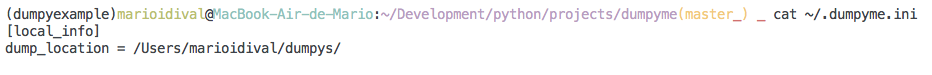
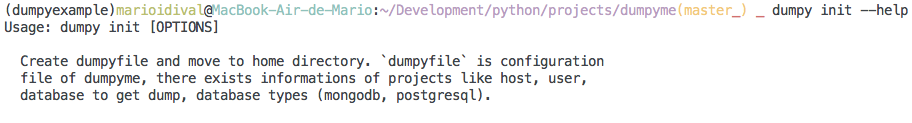
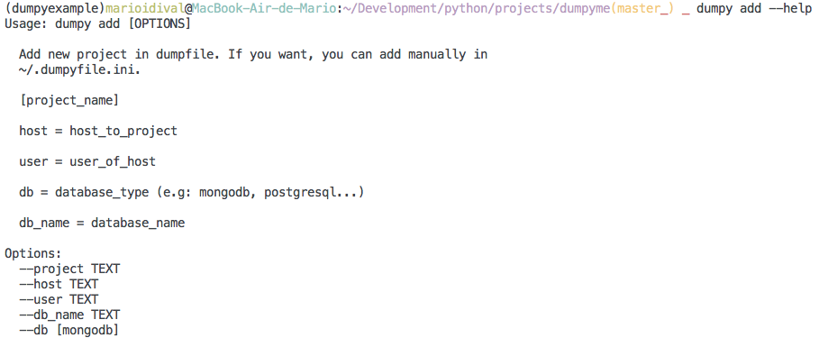
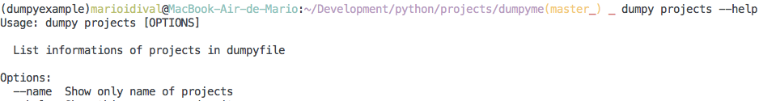
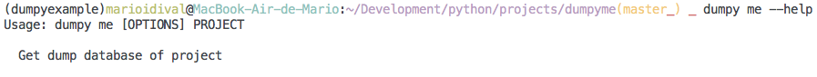
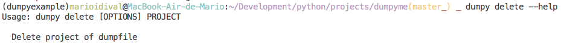

# Dumpy Me

Command line package to get dumps of databases

## Install

    pip install dumpyme

## Usage

### 1 - Create dumpyfile

    dumpy init
	Creating dumpyfile...
	dumpyfile in your home directory as ~/.dumpyfile.ini

##### Initial dumpyfile:

##### help:

### 2 - Add some project in dumpyfile

    dumpy add
	Project name: my_project
	Host of project: 187.111.44.100
	User of host: root
	Name of database: my_project_db
	Database Type (e.g: mongodb, postgresql...): mongodb

	Adding in dumpyfile:
			Project: my_project
			Host: 187.111.44.100
			Database: my_project_db
			Database Type: mongodb

##### help:

### 3 - List projects in dumpyfile

	dumpy projects
	Projects:
	========================================
	-------> my_project
					host: 187.111.44.100
					db_name: my_project_db
					db mongodb
					user: root
	-------> my_project2
					host: 192.191.190.89
					db_name: my_project2_db
					db: mongodb
					user: my_root
	-------> project2
					host: 182.182.82.82
					db_name: project2_production
					db: mongodb
					user: riit
	========================================

or list name of projects:

	dumpy projects --name
	Projects:
	========================================
			my_project
			my_project2
			project2
	========================================

##### help:

### 4 - Get dump of project

    dumpy me my_project

##### help:

### 5 - Delete projects in dumpyfile

	dumpy delete my_project
	Project removed sucessfully

### Databases supported
* MongoDB
