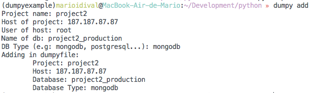

# Dumpy Me

Command line package to get dumps of databases

### Install

    pip install dumpyme

### Usage

##### 1 - Create dumpyfile

    dumpy init

##### 2 - Add some project in dumpyfile

    dumpy add

This command will ask questions about the project

##### 3 - Get dump of project

    dumpy me my_project

### Databases supported
* MongoDB
